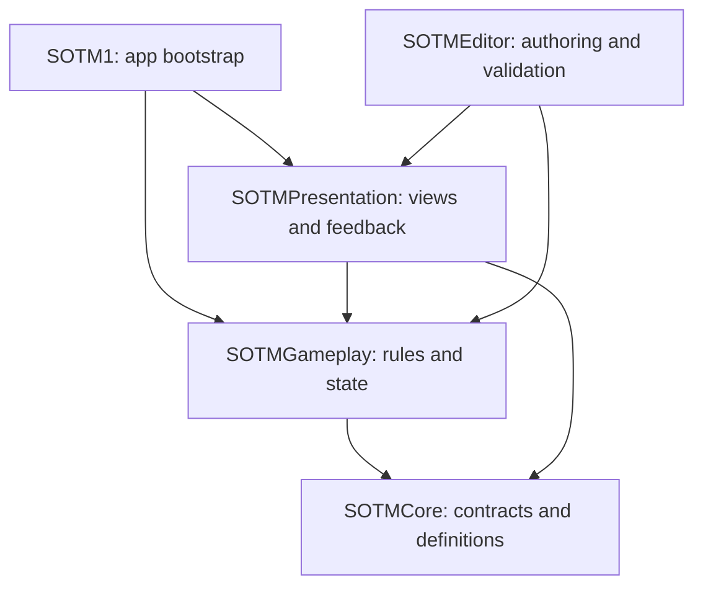
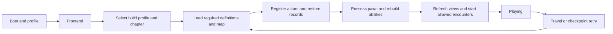

# Part 1 — Foundation and Code Setup

[Handbook index](README.md) · [Gameplay contracts](02-Gameplay-System-Contracts.md) · [Authoring](03-Authoring-and-Team-Workflows.md) · [Implementation](04-Implementation-and-Validation.md)

## 1. Architecture decisions

The foundation should make existing kinds of content cheap to add while keeping invalid combinations difficult to ship. Complexity is justified when it provides ownership, isolation, observable failure, or faster authoring. The following are deliberate starting decisions.

| Decision | Baseline | Reason and change boundary |
| --- | --- | --- |
| Target | Windows desktop, single player, keyboard/mouse and gamepad | Current material describes a single-player game. Networking, VR, and split-screen need separate design work. A configured VisionOS target is not a requirement. |
| Camera | First-person exploration; authored camera modes for capture and cinematics | Fits the requested horror examples. A third-person mode can use the same gameplay contracts but requires its own camera/animation validation. |
| Engine | Pin 5.8.2 once the authoritative project is selected | Installed version was verified. Do not mix 5.6 and 5.8 binaries or resave older content indiscriminately. |
| Framework | C++ foundations with Blueprint composition | Central invariants remain enforceable; content authors retain visual iteration. |
| Abilities | Gameplay Ability System (GAS) | Powers, effects, costs, cooldowns, damage, and stun share one supported framework. Currency remains an integer ledger. |
| Enemy decisions | Behavior Trees and Blackboards | Use one decision owner per enemy. StateTree is an alternative requiring a specific decision, not a second simultaneous brain. |
| UI | CommonUI with typed presentation objects and change delegates | Separate state from appearance; implement focus and controller navigation centrally. |
| Input | Enhanced Input for gameplay; CommonUI standard actions for menus | Validate routing explicitly. Do not assume CommonUI's Enhanced Input integration is production-ready just because both plugins exist. |
| Persistence | Retain coherent progression on death; reset player and encounter transients at a checkpoint | Purchased abilities remain owned, consumed pickups remain consumed, lives remain spent. |
| Content delivery | Asset Manager and build profiles; chapters as content boundaries | Game Feature plugins are optional later if independently delivered features require activation/unloading. |
| World layout | Chapter maps and bounded encounter areas | Use streaming where the measured map needs it; no World Partition requirement for every corridor. |

Epic provides GAS for coordinated abilities/effects and CommonUI for input routing and UI layers. The project policies above specify how to use those capabilities. [GAS overview](https://dev.epicgames.com/documentation/unreal-engine/gameplay-ability-system-for-unreal-engine?lang=en-US), [CommonUI input guide](https://dev.epicgames.com/documentation/unreal-engine/commonui-input-technical-guide-for-unreal-engine?lang=en-US).

## 2. Establish the real project before coding

Existing root configuration points to `BP_MenuSystemGameInstance` and `BP_PlayLevelGameMode` from MenuSystemPro, with different editor and game startup maps. CommonUI's viewport class and Enhanced Input classes are configured. Common Input's Enhanced Input support flag is already true. The nested 5.6 project points to a SuperPowers map and game mode. Neither game descriptor currently declares a project C++ module.

These observations identify integration work, not broken or unused assets. Content folders include multiple UI, skill-tree, ability, AI, and environment packs; directory names do not prove their runtime behavior.

Before adopting this architecture:

1. Select the authoritative `.uproject` and pin its exact engine build and plugin versions in a team environment manifest.
2. Create a reversible migration branch/checkpoint. Keep both existing projects and source assets until references and unique work have been reviewed in Unreal.
3. Record existing startup flow, menu entry points, input bindings, save slots, player class, AI class, and packaged demo behavior. Capture reproducible bug cases before replacing systems.
4. Compile Blueprints and package a baseline development build. Record failures rather than attributing them to the new architecture later.
5. Add a native project module through Unreal's C++ project workflow. Use the installed engine's supported compiler and SDK; let its generated targets establish current build settings.
6. Implement the framework first in `L_ArchitectureLab`. Keep normal game maps using their existing mode until adapters pass the migration tests.

Review required `Build/` configuration with the repository owner before establishing CI. The existing ignore rules intentionally ignore all `Build/` directories and map build-data assets. If icons, platform configuration, or baked map data become build inputs, document how clean checkouts obtain them; do not silently change this existing policy.

## 3. Source modules and dependencies

Create a small number of enforceable module boundaries. These are ordinary Unreal modules inside the project; no Codex plugin or separate Unreal plugin per gameplay feature is needed.

```text
Source/
  SOTM1/                    primary game module; concrete app bootstrap
  SOTMCore/                 IDs, tags, interfaces, results, snapshots, definitions
  SOTMGameplay/             state owners, rules, abilities, AI, world actors
  SOTMPresentation/         UI, camera, audio presentation, cosmetic adapters
  SOTMEditor/               editor-only validators, factories, details, launchers
  SOTM1.Target.cs
  SOTM1Editor.Target.cs

Content/SOTM/
  Core/                     shared definitions and defaults
  Player/                   player BPs, animation, input, powers
  Enemies/Common/           shared enemy templates and animation contracts
  UI/                       screens, styles, presenters' preview data
  World/                    interactions and level design templates
  Chapters/CH01/            Isabel, forest, Timmy, objectives, sequences
  Chapters/CH01/Teaser/     only Silken Mother assets used in Chapter 1
  Tests/                    laboratories and deterministic scenarios
```



Arrows mean compile dependencies. `SOTMGameplay` must not include `SOTMPresentation`; it requests presentation through interfaces/delegates defined in Core. Presentation registers listeners and handlers. Actor references in Core are generic or interface-based; shared definitions can reference engine asset classes such as a skeletal mesh, montage, or sequence without importing game presentation code.

| Module | Public dependencies when exposed in headers | Typical private dependencies |
| --- | --- | --- |
| SOTMCore | Core, CoreUObject, Engine, GameplayTags | DeveloperSettings if settings implementation needs it |
| SOTMGameplay | SOTMCore, GameplayAbilities, GameplayTags, GameplayTasks; Engine/Core modules as required | AIModule, NavigationSystem, EnhancedInput, InputCore; Niagara only if directly used |
| SOTMPresentation | SOTMCore, SOTMGameplay; UMG/CommonUI only if public classes derive from their types | CommonInput, EnhancedInput, Slate, SlateCore, LevelSequence, MovieScene, AudioMixer as directly needed |
| SOTMEditor | Core, CoreUObject, Engine; project types needed by public headers | UnrealEd, DataValidation, AssetTools, PropertyEditor, ToolMenus, Slate, SlateCore, relevant project modules |
| SOTM1 | Core and project modules used by bootstrap | Keep this module thin |

This table is a dependency plan, not a claim that every listed module belongs in every `.Build.cs`. Add the module providing each included type; use forward declarations when possible. If `SOTMCore` definitions expose a GAS class in a public header, either reference a Core abstraction or explicitly add that engine dependency. Do not hide a real dependency behind a transitive include.

Register runtime modules as `Runtime` and `SOTMEditor` as `Editor` in the descriptor; include the editor module only in the editor target. Provide `Public/` and `Private/` per module, its API export macro, and module implementation. No runtime header may depend on `UnrealEd`. Test content and editor helpers must be excluded from shipping profiles.

Enable and validate the relevant engine plugins: GameplayAbilities, EnhancedInput, CommonUI, DataValidation, and required cinematic/audio tooling. GameplayTags, GameplayTasks, AI, and navigation are module dependencies, not a list of independently enabled gameplay plugins. Use optional Motion Warping only for actions that need it.

The installed 5.8.2 UMG Viewmodel descriptor marks it **Beta**, consistent with Epic's documentation. The CommonUI/Enhanced Input integration page still carries an **Experimental** warning. Start with typed `UObject` presenters and delegates, and normal CommonUI UI action data; a short packaged-build compatibility test can justify retaining the existing bridge or adopting MVVM. The root project currently enables the bridge: disable it and restart in the migration checkout when adopting the baseline, or explicitly document the tested alternative. This setting is project-wide; a different test GameMode alone does not isolate it. Do not confuse this bridge status with Enhanced Input's ordinary gameplay use. [UMG Viewmodel](https://dev.epicgames.com/documentation/en-us/unreal-engine/umg-viewmodel-for-unreal-engine), [CommonUI integration guidance](https://dev.epicgames.com/documentation/en-us/unreal-engine/using-commonui-with-enhnaced-input-in-unreal-engine).

## 4. Framework class ownership

All project class names below are proposed. Prefix shared types consistently in production if namespace collisions require it. Lifetime is part of a type's contract.

| Class | Lifetime and responsibility | Explicit boundary |
| --- | --- | --- |
| `USOTMGameInstance` | Application session; minimal bootstrap and service integration | Does not contain every gameplay variable or retain level actors |
| `ASOTMGameModeBase` | Current world rules; selects spawn/flow policies and framework classes | No UI creation, wallet, or persistent profile data |
| `ASOTMFrontendGameMode` | Menu world configuration | No chapter AI/encounter startup |
| `ASOTMChapterGameMode` | Chapter rules, readiness coordination, spawn authorization | Delegates persistence and transactions to their owners |
| `ASOTMGameStateBase` | Observable current-world status: chapter/phase/readiness | Snapshot/projection; not another progression ledger |
| `ASOTMPlayerState` | Player ASC and attribute sets across pawn replacement in the same world | Not the disk save; ordinary map travel may replace it |
| `ASOTMPlayerController` | Local intent, possession, interaction requests, camera manager integration | No purchase or death authority in input handlers |
| `ASOTMPlayerCharacter` | Physical avatar; movement, collision, animation, interaction components | No profile state; replaceable at respawn |
| `ASOTMPlayerCameraManager` | Effective camera mode, blends, clamps, accessibility scaling | No story outcomes or life accounting |
| `ASOTMEnemyCharacter` | Enemy body, ASC/attributes, movement and animation | Does not decide objective or chapter completion directly |
| `ASOTMAIController` | Perception adapter, Blackboard, Behavior Tree, navigation requests | One controller owns navigation for its pawn |
| `ASOTMCompanionCharacter` | Optional physical guide representation | Critical objectives work if it is absent |

Use `AGameModeBase` with `AGameStateBase` consistently. If multiplayer match flow is later required, reassess the paired `AGameMode`/`AGameState` design. Unreal's GameMode is authority-side; GameState exposes world status. Single-player authority boundaries are useful organization, not an assertion that this plan already supports multiplayer. [Gameplay Framework](https://dev.epicgames.com/documentation/en-us/unreal-engine/gameplay-framework-in-unreal-engine).

Preserve required `Super` lifecycle calls, including `Super::StartPlay()`: the GameModeBase/GameStateBase path participates in beginning actor play. On player possession, initialize ASC actor information with PlayerState as OwnerActor and the character as AvatarActor. PlayerState implements `IAbilitySystemInterface` and the character forwards that interface to its ASC. On avatar removal, cancel avatar-bound abilities, remove temporary grants/effects according to policy, unbind listeners, and detach the avatar. On non-seamless travel, rebuild ASC grants from saved upgrade definitions; do not expect PlayerState to survive. Enemy ASC ownership stays on the enemy actor.

### 4.1 Services selected by lifetime

| Service | Base/lifetime | Owns |
| --- | --- | --- |
| `UGameFlowSubsystem` | GameInstance subsystem | Application flow, transition generation, accepted death IDs, travel orchestration |
| `USaveSubsystem` | GameInstance subsystem | Save envelopes, slot IO queue, migrations, durable revisions and recovery |
| `UProgressionSubsystem` | GameInstance subsystem | Active run ledger: lives, wallet, inventory, upgrades, retained world facts, objective records |
| `UChapterSubsystem` | World subsystem, gameplay worlds only | Active chapter definition, readiness barrier, encounter activation and checkpoint restore orchestration |
| `UWorldStateSubsystem` | World subsystem, gameplay worlds only | Persistent participant registry; applying retained/reset records to loaded actors |
| `UObjectiveSubsystem` | World subsystem, gameplay worlds only | Evaluates active conditions; submits transitions to progression owner |
| `UAudioNarrativeSubsystem` | World subsystem, gameplay worlds only | Dialogue queue, hint scheduling, music intent and world audio integration |
| `UPresentationSubsystem` | LocalPlayer subsystem | Screen layers, presenters, local restriction leases and camera/UI input policy |
| `USOTMEditorSubsystem` | Editor subsystem | Authoring operations and scenario launcher; never cooked |

Keep asset discovery/loading on Unreal's `UAssetManager`. Add a project subclass only if required for boot policy or specialized loading. Use `UGameUserSettings` for supported device/video settings, plus a small profile settings record for accessibility and preferences; do not duplicate its resolution and scalability implementation.

A subsystem is not a reason to create a new singleton for every feature. Wallet and upgrades deliberately share a transaction owner. Actor-specific behavior belongs in components. Epic's subsystem framework supplies managed lifetimes and Blueprint access; the ownership division here is a project decision. [Programming Subsystems](https://dev.epicgames.com/documentation/en-us/unreal-engine/programming-subsystems-in-unreal-engine).

### 4.2 Lifetime traps to prevent

- Filter gameplay WorldSubsystems to Game and PIE worlds; installed 5.8 headers also permit Editor worlds by default.
- A frontend is also a Game/PIE world. Chapter, objective, and encounter services remain dormant until a valid ChapterDefinition activates them. AudioNarrative supports an explicit frontend music mode without starting chapter dialogue or encounters.
- Use the actual world/local-player context. Never use a process-wide static active-world pointer or assume the first controller is the caller.
- Declare subsystem initialization dependencies with the engine dependency mechanism, then use explicit readiness for assets, possession, and world participants. `Initialize`, `BeginPlay`, and `OnWorldBeginPlay` alone are not a complete readiness barrier.
- GameInstance services store stable IDs and plain records, not strong references to actors in old worlds. World services unregister actors at EndPlay; local-player services detach old presenters during travel.
- Each async operation captures a weak target, operation ID, and world/run generation. A completion from an old generation is discarded.
- Release delegates, timers, streamable handles, input contexts, and leases in every terminal path. PIE start/stop must not accumulate subscribers or preserve test state.

## 5. Boot, entry, travel, and shutdown



1. Load settings and validate the selected build profile. Profile corruption falls back to a recoverable settings state; do not silently overwrite the damaged file.
2. New Game creates a new run ID with five lives and initial grants from `UChapterDefinition`. Continue selects a compatible saved run and validates content availability.
3. GameFlow enters `Loading`, increments world generation, cancels old requests, and obtains loading/input restrictions.
4. Asset Manager loads required definitions and bundles. Class/asset failure produces an actionable loading error or an explicit optional fallback, never an endless spinner.
5. Travel to the map. Chapter subsystem waits for required streaming areas, world registration, checkpoint anchor, spawn collision clearance, and navigation needs. Optional distant actors must not hold the barrier forever.
6. Restore world records before exposing interactions. Spawn/possess the player at the validated anchor; reconstruct ASC grants and initial attributes.
7. Bind presenters to the new state generation and read snapshots. Evaluate objective predicates without replaying acquisition/reward events.
8. Confirm mandatory requirements or timeout with a recovery action. Release only this transition's restrictions; enter `Playing` and activate authorized encounters.

Do not implement map loading screens as a widget whose animation requires the game thread during blocking travel. Use the engine's supported loading-screen mechanism for blocking loads, or a persistent frontend with asynchronous preparation. Validate first packaged startup and slow storage. A retry may reuse the map and perform steps 5–8 without physical travel, but it must use the same restoration contract.

Shutdown stops accepting gameplay mutations, cancels world work, and drains or explicitly abandons the save queue within a bounded exit policy. The UI distinguishes a saved revision from pending changes.

## 6. Data model and identity

### 6.1 Choose the right authoring surface

| Surface | Use it for | Avoid |
| --- | --- | --- |
| `UPrimaryDataAsset` definition | Identity-bearing enemy, chapter, upgrade, objective, encounter, cinematic and ability definitions | Mutable health, current coins, live target pointers |
| `UDataAsset` | Small non-primary shared profiles or style data | Assuming every data asset is automatically registered/cooked |
| `UDataTable` + typed `FTableRowBase` | Homogeneous tuning rows, rank prices, dialogue cues, reward lists | A universal table full of unrelated optional columns |
| `UCurveFloat` / Curve Table | Continuous curves such as awareness response or speed interpolation | Hiding progression dependencies in opaque curves |
| Blueprint child class | Mesh/component composition, compatible AnimBP, approved behavior extension | Copying the entire economy/AI framework to change a mesh |
| Instance settings | Definition, role bindings, permitted overrides, persistent identity | Arbitrary rewrites of shared rules in each placed actor |
| `UDeveloperSettings` | Project service defaults, content roots, collision/config contracts | Run state or per-save player settings |

The baseline uses instances of native Data Asset subclasses. Blueprint-class primary assets require a separate documented class-default-object identity/scan policy; do not mix the two authoring models accidentally. Definitions are immutable during play. Copy selected tuning into per-instance runtime configuration before applying difficulty/effects. A shared data asset changed at runtime affects every consumer and can contaminate PIE behavior.

Epic's Primary Data Assets support primary IDs and bundles; Asset Manager handles discovery/loading. The exact definition schemas and identity policy here are project design. [Data Assets](https://dev.epicgames.com/documentation/en-us/unreal-engine/data-assets-in-unreal-engine).

### 6.2 Stable identifiers

Use `FPrimaryAssetId` for reusable definitions, a serialized `FGuid` for placed persistent instances, and `FGameplayTag` for semantic categories. These solve different problems.

- Override definition `GetPrimaryAssetId()` to return a fixed type plus an explicit immutable `ContentId`, such as `Upgrade:CH01.SpeedBoost`. The default asset-name identity is not rename-proof.
- Display text uses `FText`. A localized character name or asset folder name is never a save key.
- Duplicating a definition also copies a normal ContentId property. The content factory assigns a new ID for new definitions, while moving/renaming an existing asset preserves it; validation catches bypasses.
- Placed actors carry a project runtime `UPROPERTY` GUID in a persistence component. Unreal's editor ActorGuid/ActorInstanceGuid are editor-only in the inspected headers and are not the packaged save contract.
- Generate placed identity through editor tooling when creating an instance. Ordinary duplication gets a new ID; PIE duplication and load preserve it. Replacing an actor intentionally requires identity transfer or a migration.
- For repeated level instances, form identity from a stable level-instance placement ID and local participant ID. For spawned persistent actors, store a spawn record with its own stable ID. Runtime object names are insufficient.
- IDs must be unique in the relevant catalog/world scope. Validation rejects duplicates; it does not silently regenerate IDs already used in saves.

### 6.3 Definition catalog

Every definition includes `ContentId`, owner/content-set tags, authoring/schema version, editor notes, and declared dependencies. Version fields support migration/validation; they do not automatically migrate anything.

| Definition | Core fields |
| --- | --- |
| `UChapterDefinition` | Chapter ID, map, required asset IDs, initial abilities, entry checkpoint, objective roots, run policy, build availability, terminal outcome |
| `UEnemyDefinition` | Pawn visual class, movement/animation set, behavior asset, perception settings, attacks, encounter role, difficulty profile |
| `UMovementDefinition` | Gaits, speeds, acceleration/braking, stance rules, stamina policy, supported custom modes |
| `UAnimationSetDefinition` | Compatibility family, locomotion/layer assets, montage slots, sockets, action timing contracts, camera presentation |
| `UAbilityDefinition` | GAS implementation reference, input tag, tuning, costs/cooldown, target policy, cues, content availability |
| `UUpgradeDefinition` | Granted ability/effect ID, ranks, price row reference, prerequisites, station category, localized UI |
| `UObjectiveDefinition` | Prerequisites, typed condition, progress scope, completion/failure policy, outcomes, marker and hint IDs |
| `UEncounterDefinition` | Spawn/arena roles, activation, enemy roster, escalation, reset and completion rules, deterministic seed policy |
| `UCinematicDefinition` | Sequence, role binding requirements, skip/abort policy, staging mode, timeout, fallback, outcome reference |
| `UDialogueSetDefinition` | Typed dialogue table/rows, cue groups, priorities and interruption policies |
| `UBuildProfileDefinition` | Demo/full availability, entry/exit, allowed chapters, content labels, save compatibility, shipping overrides |
| `UTestScenarioDefinition` | Lab map, starting ledger, checkpoint, actor/encounter set, seed, expected result, isolated save namespace |

References may use primary IDs for catalog entities and soft object/class references for their secondary assets. Avoid mirrored `Cost` values in both upgrade assets and tables: identify the sole source field. Override precedence is **definition → selected difficulty/build profile → explicitly allowed instance override → transient gameplay modifier**. Expose the resolved values and their source in diagnostics.

### 6.4 Example reflected contract

This is an illustrative header excerpt, not a complete compilable file. Add the module export macro, required includes, generated header, forward declarations, and implementation in the selected module.

```cpp
USTRUCT(BlueprintType)
struct FPurchaseResult
{
    GENERATED_BODY()
    UPROPERTY(BlueprintReadOnly) bool bSucceeded = false;
    UPROPERTY(BlueprintReadOnly) FGameplayTag FailureReason;
    UPROPERTY(BlueprintReadOnly) int64 NewBalance = 0;
    UPROPERTY(BlueprintReadOnly) int32 NewRank = 0;
    UPROPERTY(BlueprintReadOnly) int64 Revision = 0;
};

UCLASS(BlueprintType)
class UUpgradeDefinition : public UPrimaryDataAsset
{
    GENERATED_BODY()
public:
    // Set by the content factory; changes require a save migration.
    UPROPERTY(VisibleAnywhere, BlueprintReadOnly, Category="Identity")
    FName ContentId;

    UPROPERTY(EditDefaultsOnly, BlueprintReadOnly, Category="Display")
    FText DisplayName;

    UPROPERTY(EditDefaultsOnly, BlueprintReadOnly, Category="Rules",
              meta=(ClampMin="1", UIMin="1"))
    int32 MaxRank = 1;

    UPROPERTY(EditDefaultsOnly, BlueprintReadOnly, Category="Display",
              meta=(AssetBundles="UI"))
    TSoftObjectPtr<UTexture2D> Icon;

    virtual FPrimaryAssetId GetPrimaryAssetId() const override
    {
        return ContentId.IsNone() ? FPrimaryAssetId()
            : FPrimaryAssetId(FPrimaryAssetType(TEXT("Upgrade")), ContentId);
    }
};
```

`ClampMin` improves editing; runtime commands still check bounds, missing IDs, overflow, and prerequisites. `BlueprintReadOnly` is an authoring boundary, not a replacement for encapsulated native mutation.

### 6.5 Loading and cooking

Register each primary type with the Asset Manager: its native base class, intended content directory, whether entries are data instances or Blueprint class assets, and cook policy. Test registration using the actual overridden primary type; a scan type that differs from `GetPrimaryAssetId()` creates confusing lookup failures.

Use explicit bundles such as `UI`, `Gameplay`, and `Cinematic` for relevant secondary assets. Load gameplay dependencies before spawning an encounter; preload kill-presentation assets before an enemy can capture. Keep handles until consumers finish. Define required versus optional dependencies and how cancellation releases them.

An ID alone does not make its referenced assets cookable. Build dependency validation that resolves definition IDs, expands required bundles/relationships, and compares them with the cooked catalog. Use labels/rules for demo/full inclusion, then inspect cooked output. Avoid a hard reference from a global defaults asset to every chapter. [Asset Management](https://dev.epicgames.com/documentation/en-us/unreal-engine/asset-management-in-unreal-engine).

## 7. Commands, queries, delegates, and interfaces

Treat these as different contracts:

| Contract | Meaning | Example |
| --- | --- | --- |
| Query | Read a current snapshot; no mutation | `GetWalletSnapshot()`, `GetInteractionOffer()` |
| Command | Ask the owning system to change state; return acceptance/result | `TryPurchaseUpgrade(Request)`, `TryAcceptDeath(Context)` |
| Event | Announce a fact after a committed change | `OnWalletChanged`, `OnObjectiveTransitioned` |
| Interface | Capability independent of concrete class | Interactable, save participant, cinematic role provider |

Use direct typed commands where the receiver matters. Use native multicast delegates for internal observation and `BlueprintAssignable` dynamic multicast delegates where designers need Event Dispatchers. Prefer typed payload structs to unstructured object arrays or string messages. Gameplay Tags classify semantic events; they do not provide persistent state, reliable delivery, or transaction ordering.

Do not invent an untyped global event bus. If a project-wide message router later becomes useful, implement or deliberately adopt one with typed channels, listener lifetime, trace IDs, and bounded use. Lyra sample facilities are not automatically present in this project.

Each mutable owner publishes a monotonically increasing revision. A late widget subscribes, reads a snapshot, and ignores notifications at or below its applied revision. Serialize publication on the game thread. When one command produces several linked changes, publish after the transaction is complete, and prohibit immediate reentrant mutations while iterating listeners; queue nested commands.

Minimum interfaces:

- `ISOTMInteractable`: query offer, try execute, cancel; request includes instigator, target, operation, and request ID.
- `ISOTMWorldStateParticipant`: stable identity, capture a typed record, apply record idempotently, reset transient state, report ready.
- `ISOTMCinematicRoleProvider`: resolve a requested role to a compatible live participant.
- `ISOTMObjectiveTarget`: expose semantic marker/condition identity without coupling objectives to an actor class.
- `ISOTMDamageReceiver` only for non-GAS environmental receivers; GAS actors follow one damage/effect pipeline.

Use `BlueprintNativeEvent` for supported default behavior that designers can specialize and `BlueprintImplementableEvent` for presentation hooks with no required authoritative result. A hook named `OnPurchasedVisuals` must not be responsible for actually granting the upgrade.

## 8. Persistence and checkpoint policy

### 8.1 Selected behavior

A run starts with five lives. Every accepted death consumes one, including the fifth death which leaves zero and produces Game Over. **Normal death retains the entire progression ledger**: currency balances, expenditures, collected pickup IDs, owned upgrades, keys, opened chests/gates, completed objectives, and story outcomes. Checkpoints restore the player to a safe entry and reset eligible encounter transients. They do not rewind progression or restore spent lives.

This default makes purchased powers feel reliable and prevents farming the same coins on retry. It is a recommendation, not a claim in the client material. If a later mode uses rollback checkpoints, implement a separate tested policy that rewinds the whole linked ledger, rather than independently toggling coin and chest persistence.

| Scope | Examples | Death retry | New chapter run |
| --- | --- | --- | --- |
| Profile | Settings, accessibility, chapter completion/unlocks | Retain | Retain |
| Run ledger | Lives, wallet, upgrade ranks, inventory, retained objectives, consumed/opened world records | Retain, with life already decremented | Reset to chapter initial state |
| Checkpoint descriptor | Stable anchor/area IDs, encounter entry recipe, safe spawn transform fallback | Use for reconstruction | Use chapter entry |
| Checkpoint-reset state | Boss attempt/phase, resettable enemies, local encounter hazards | Restore documented entry state | Reset |
| Transient | Perception memory, active projectiles/effects, input leases, UI screens, dialogue queue | Cancel/recreate | Clear |

An objective such as "stun Isabel three times during this attempt" is encounter-scoped and resets with the attempt. A persistent objective such as "obtain the gate key" does not. Define the scope in data and validate its dependent outcomes. Do not let a resettable counter permanently open a gate before its authoritative completion transaction.

The table's new-run reset describes a fresh/replayed chapter, not advancing a campaign. Chapter advancement imports approved recovered powers and story facts through a versioned carryover policy; Chapter 1 writes that completion record without implementing Chapter 2 gameplay. See Part 4, section 4.2.

### 8.2 Save envelope

Use a custom `USaveGame` envelope containing plain records, not a serialized actor graph:

```text
Header: Magic, SaveSchemaVersion, ContentCatalogVersion, BuildProfileId,
        SlotGeneration, SnapshotRevision, Timestamp, Checksum
Profile: completion/unlock facts and profile revision as appropriate
Run: RunId, ChapterId, RemainingLives, RunStatus, CheckpointDescriptor
Progression: Wallets, UpgradeRanks, Inventory, ObjectiveRecords,
             ConsumedPickupIds, RetainedWorldRecords, AppliedOutcomeIds
Recovery: LastStableFlowState, PendingDeathId/PresentationPolicy if needed
```

Persist stable IDs, enum/struct values, and specifically supported timers as remaining durations if necessary. Do not persist live ASC handles, raw actor references, delegates, active sequence players, or navigation requests. Rebuild ability grants/effects from definitions and saved ranks. Transient ability cooldowns reset on normal retry by default; designers must balance this intentional policy and prevent repeatable checkpoint activation from resetting cooldowns without a real retry.

### 8.3 Transaction, durability, and recovery

`UProgressionSubsystem` changes run records on the game thread through commands. A committed transaction is visible in memory before it is necessarily on disk. `USaveSubsystem` snapshots the entire coherent envelope and serializes writes; its asynchronous completion marks only the exact revision written as durable.

Use two alternating complete save generations with revision and integrity metadata. Write the next generation without destroying the previous valid one, check completion, and select the newest valid generation on load. A checksum catches accidental corruption; it is not an anti-cheat mechanism. Do not assume the engine's async SaveGame call gives multi-file atomic transactions or guaranteed crash durability.

Save at checkpoints, purchases, key/chest milestones, death acceptance, chapter completion, and explicit safe quit. Coalesce trivial pickup saves if needed while displaying the actual save status. Queue ordering must ensure a later life decrement cannot be overwritten by an older autosave. A failed write keeps the last valid generation and dirty revision, with a retry option.

For consistent profile/run completion, commit the chapter outcome into the run envelope first, then project it idempotently into profile unlocks. Recovery reconciles a run completion that reached disk before the separate profile write. Never advertise a chapter as safely saved merely because its teaser finished.

No local save design can promise a just-accepted action survives power loss before durable completion. After a crash, load the newest valid full revision; do not combine lives from one file with coins from another. If strict crash-resistant life consumption becomes a product requirement, specify and test that separate durability policy.

Epic supplies SaveGame serialization and synchronous/asynchronous IO entry points. Generation recovery, consistency groups, migrations, and save-status UX are implementation responsibilities. [Saving and Loading](https://dev.epicgames.com/documentation/unreal-engine/saving-and-loading-your-game-in-unreal-engine).

### 8.4 Restoration sequence

1. Stop accepting normal interactions, cancel attacks/abilities/dialogue, invalidate pending callbacks, and stop AI navigation.
2. Prepare the checkpoint area and clear encounter-owned transient spawns. Retained state remains in the current ledger.
3. Apply retained records to loaded participants before collision/interactions become available. A consumed pickup stays consumed; an opened gate remains open even if its key was consumed.
4. Recreate checkpoint-reset actors/encounters using their reset recipe. Streamed participants register later and immediately receive the correct record for this generation.
5. Validate the checkpoint spawn and reachable exit. If blocked, use an authored fallback spawn or report an invalid checkpoint; never blindly teleport into geometry.
6. Rebuild the player avatar/attributes, regrant owned abilities exactly once, and clear stale perception and target memory.
7. Restore objective projections and refresh UI snapshots. Do not emit collection/reward events while applying records.
8. Confirm readiness and resume. Reject a completion callback from the prior attempt.

Only capture checkpoints at authored stable entry points. Boss checkpoints must provide a restartable arena entry, already-open access gates, and the required powers. A checkpoint that respawns the player on the wrong side of a one-way gate is invalid even if its transform is collision-free.

### 8.5 Schema and content changes

Implement explicit sequential save migrations (`v1 → v2 → v3`) with fixture saves and failure reporting. Maintain content-ID redirects/tombstones for renamed or removed definitions. Missing optional collectibles can be skipped with a diagnostic; missing required chapter definitions must offer a supported recovery path. Never quietly reset the user's progress on a migration failure.

Give demo and full builds distinct slot namespaces initially. If demo-to-full import is desired, implement an explicit migration that validates available chapters/abilities and copies a coherent state. Full saves loaded in a demo must be rejected or handled by a documented conversion.

## 9. Cross-cutting rules

| Concern | Required rule |
| --- | --- |
| Time | Gameplay cooldowns/AI timers use paused game time; UI transitions and loading watchdogs use appropriate real time. Cinematic timeout policy explicitly accounts for pause. |
| Input/camera restrictions | Acquire owner-scoped handles; release only the handle owned by that operation. Nested pause, cinematic, and death cannot undo each other's restrictions. |
| Cancellation | Every async task has success, rejection/failure, cancellation, timeout, and world-end paths. Terminal results occur once. |
| Randomness | Encounter-scoped random stream/seed for reproducible bugs; no dependence on global random call ordering. |
| Localization | `FText`/String Tables for user-visible text, stable cue IDs, plural-aware coin/progress text, keyboard/gamepad glyph substitution. |
| Performance | Event-driven work and bounded updates; no global actor scans or synchronous asset loads in combat/UI hot paths. |
| Diagnostics | Structured category, operation/run/instance IDs, state revision, reason code, and traceable authoring source. No per-frame log spam. |
| Ownership | Mutable UObjects use reflected references/managed lifetime; weak world references where ownership is external; definitions stay read-only. |
| Extension | Add a supported condition/task/ability/component with validation and a test recipe; avoid a universal scripting interpreter. |

The next part turns these foundation rules into concrete gameplay contracts. Implement the smallest end-to-end test loop before assembling the full forest.
