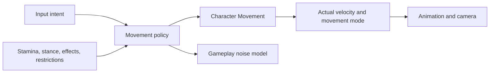
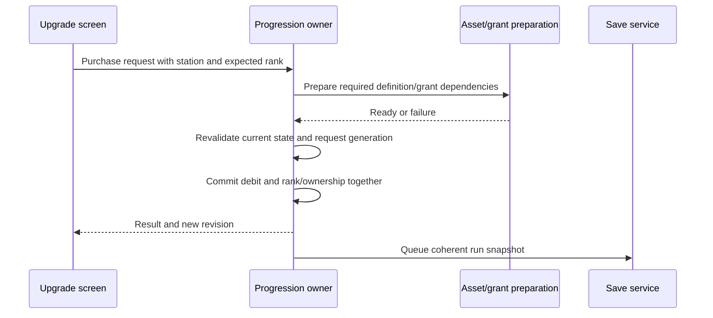
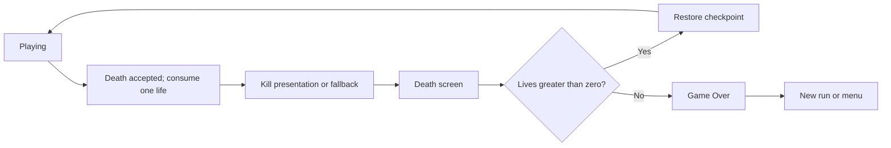

# Part 2 — Gameplay System Contracts

[Handbook index](README.md) · [Foundation](01-Foundation-and-Code-Setup.md) · [Authoring](03-Authoring-and-Team-Workflows.md) · [Implementation](04-Implementation-and-Validation.md)

All named project systems, commands, assets, and tools in this part are proposed implementation contracts. Use the ownership and retained-progression policy from Part 1 throughout. Numerical examples below are tunable starting examples, not approved game balance.

## 1. Player composition and input

`ASOTMPlayerCharacter` contains the body and components needed by an avatar: Character Movement, an interaction scanner, movement policy, camera attachment points, animation, and a persistence participant where needed. Its PlayerState supplies the ASC. PlayerController receives input intent and forwards supported commands; it does not directly set movement speeds, edit upgrade ranks, or spawn death UI.

Suggested Enhanced Input actions:

| Action/tag | Value and behavior | Owner |
| --- | --- | --- |
| `IA_Move` / `Input.Move` | Axis2D, dead zones and device modifiers | Controller → movement intent |
| `IA_Look` / `Input.Look` | Axis2D, independent mouse/gamepad sensitivity | Controller/camera manager |
| `IA_Sprint` / `Input.Sprint` | Hold or toggle by setting | Movement policy |
| `IA_Crouch` / `Input.Crouch` | Hold/toggle, validated clearance on exit | Movement policy |
| `IA_Interact` / `Input.Interact` | Press/hold from current interaction offer | Interaction component |
| `IA_AbilityPrimary` | Slot intent resolved to owned ability ID | ASC input adapter |
| `IA_AbilitySecondary` | Slot intent resolved to owned ability ID | ASC input adapter |
| `IA_Hint` | Request next eligible hint | Narrative subsystem |
| `IA_Pause` | Open top-level pause flow when allowed | Presentation router |
| `IA_Monitor` | Optional surveillance interaction | View-mode command |

Use mapping contexts for exploration, constrained interaction/surveillance, and intentionally different playable modes. Track which owner added a context; removing a menu must not clear all contexts. Input mapping priority is only one part of routing: screen focus, gameplay availability, and active restrictions must also agree.

Bind press/release behavior deliberately. Holding sprint while entering a cutscene must not leave sprint permanently requested after it ends. On modal transitions, cancel held interactions, resolve toggle states, and clear or re-evaluate pressed ability input according to policy. Rebind settings must handle conflicts, reset-to-default, glyph updates, and device switching. [Enhanced Input](https://dev.epicgames.com/documentation/unreal-engine/enhanced-input-in-unreal-engine).

## 2. Movement state machine

Keep Unreal's `UCharacterMovementComponent` responsible for physical movement and collision. Add `USOTMMovementPolicyComponent` to resolve intent into allowed gait and parameters. Implement a custom movement mode only when a mechanic actually needs different physics; walking, falling, and crouching should use the existing component.

Separate independent dimensions rather than creating every combination as a state:

| Dimension | Examples | Source of truth |
| --- | --- | --- |
| Physical movement mode | Walking, falling, swimming, custom | Character Movement |
| Stance | Standing, crouched | Character's actual collision/stance state |
| Requested gait | Walk, sprint | Input intent |
| Effective gait | Walk, sprint, exhausted/restricted | Movement policy derived from facts |
| Action restrictions | Stunned, interacting, cinematic, dead | Gameplay state/leases and ASC tags |
| Presentation | Lean, hand pose, breathing, camera bob | Derived animation/camera state |



The policy exposes `RequestGait`, `RequestStance`, `GetMovementSnapshot`, and `OnMovementStateChanged`. It computes effective maximum speed from the movement definition and active modifiers in one place. Abilities do not compete by independently writing `MaxWalkSpeed` and restoring stale cached values.

An initial transition contract:

| Trigger | Guard | Result |
| --- | --- | --- |
| Request sprint | Gameplay permitted, standing, sufficient stamina, sprint supported | Effective sprint; drain only under defined actual movement conditions |
| Stamina exhausted | At/below exhaustion threshold | Walk; sprint latch waits for release or configured recovery threshold |
| Request crouch | Crouch allowed in current mode | Character crouches; speed/camera derive from actual stance |
| Request stand | Ceiling/collision clearance | Uncrouch; if blocked, remain crouched without camera snapping upward |
| Become airborne | Engine movement transition | Preserve or suspend sprint request according to definition; do not invent falling physics |
| Stun/capture/death | Higher-priority restriction accepted | Cancel relevant intent/actions and stop movement safely |
| Release restriction | Remaining restrictions permit play | Re-evaluate current intent and state; do not restore an old speed blindly |

`UMovementDefinition` carries walking/sprint/crouch speed in cm/s, acceleration and braking in documented engine units, stamina drain/recovery, recovery delay, air-control policy, input toggle behavior, and supported stance transitions. Camera comfort settings override presentation intensity, not collision size.

Ordinary sprint and the recovered **Speed Boost** are separate concepts. Recommended Chapter 1 starting policy: normal locomotion has optional stamina; Speed Boost is a timed GAS modifier with cooldown. The voice documents disagree about fatigue versus cooldown, so expose that tuning decision explicitly rather than building story text into movement logic.

Gameplay noise comes from locomotion/material/action facts at a bounded cadence. Do not make enemy hearing depend on whether an offscreen footstep notify happened to run. Audio footsteps may use animation notifies; authoritative noise emission must remain testable with audio muted and animation throttled.

Required checks: sprint/crouch at low ceilings; falling into an interaction; controller reconnect; speed effect expiry during stun; 30/60/120 FPS movement consistency; slopes/stairs; spawn collision; pause during stamina recovery.

## 3. Abilities, combat, and effects

Use GAS for Health, Stamina, damage, stun, cooldowns, and temporary movement modifiers. Currency and life count remain integer progression records. Implement a small native base ability with common cancellation, diagnostics, ownership, and activation-result handling; designers can create approved Blueprint ability subclasses and tune definitions.

The lifecycle is: validate grant and state → acquire targets/resources → commit the supported cost/cooldown → execute → finish or cancel → clean up. Document refund behavior for failure before versus after commitment. Ability-specific tasks own their spawned projectiles, montage listeners, targeting indicators, and temporary restrictions.

The ability grant registry maps `(AbilityDefinitionId, GrantSourceId)` to live grant/effect handles. It reconciles saved ranks with the current ASC rather than granting duplicates each time UI opens or the pawn respawns. Serialize semantic ranks and grants, never live handles. [Ability System Component](https://dev.epicgames.com/documentation/unreal-engine/gameplay-ability-system-component-and-gameplay-attributes-in-unreal-engine?lang=en-US), [Using Gameplay Abilities](https://dev.epicgames.com/documentation/unreal-engine/using-gameplay-abilities-in-unreal-engine?lang=en-US).

### 3.1 Chapter 1 examples

| Ability | Gameplay contract | Authorable tuning/presentation |
| --- | --- | --- |
| Speed Boost | Requires owned rank, active avatar, permitted action state, cooldown ready; applies a timed movement multiplier | Duration, multiplier, cooldown, optional stamina policy, FOV/audio/VFX intensity |
| Lightning Throw | Validates target/aim and obstruction; executes one projectile or trace policy; applies stun to eligible enemies | Projectile speed/range, hit radius, stun duration, cooldown, cues, supported target categories |
| Optional passive upgrade | Recomputes derived stats from rank-owned modifiers | Curve/table values and descriptions; no custom ticking actor per rank |

Choose one projectile collision path as authoritative. If both overlap and hit callbacks arrive, resolve the same projectile execution once per permitted target. Clear pending hits on destruction/reset. A visual beam is not evidence of a valid hit through a wall.

Lightning's default cousin effect is **stun, not damage**. A committed stun event may request an encounter reaction from nearby cousins using a bounded radius, faction/encounter membership, duration, and cooldown. It does not give every enemy continuous knowledge of the player's transform. Add boss-specific response through an explicit vulnerability/phase policy; do not silently change the meaning of the shared power.

### 3.2 Damage and defeat

All gameplay damage enters one pipeline: source/target eligibility → effect calculation → health change → lethal candidate → GameFlow acceptance. Enemy defeat enters its encounter owner similarly. UI, animation, overlap components, and Sequence directors cannot decrement lives.

Queue terminal candidates rather than committing deaths/victories inside hit callbacks. Define one GameFlow terminal-resolution phase after the registered gameplay producers for that update and before terminal presentation. Candidates arriving after that phase enter the next batch. Evaluate a batch against a consistent snapshot: a valid chapter-victory candidate takes priority over a simultaneous player-death candidate; otherwise accept one valid player death. An already accepted terminal flow rejects later stale candidates. `TryAcceptDeath` submits a candidate and returns an operation handle; its accepted/rejected result arrives from this phase. The resolver alone commits life loss or victory. This explicit proposed priority must be tested and approved with the boss design.

Stun tags block relevant abilities and AI execution. Boss immunity uses declared tags/policy and communicates a readable response. Cancellation removes only effects owned by the action being cancelled. Avoid blanket effect removal that also removes persistent upgrade bonuses.

## 4. Reusable AI architecture

Compose enemies from a shared native pawn, controller, definition, perception adapter, Behavior Tree/Blackboard, abilities, and animation set. Isabel, crawling cousins, twitching cousins, and sprinting cousins can share this structure. A visually hovering doll may still use ground navigation; true flying navigation is a distinct movement/pathfinding feature and needs its own implementation and tests.

Behavior states:

```text
Dormant → Patrol → Investigate → Chase → Search → Return
                                 ↕
                               Attack
Any permitted active state → Stunned → reevaluate
Any active state → Cinematic/Captured/Dead → stop ordinary decisions
```

Behavior Tree priority branches should gate Dead/Cinematic, Stunned, Attack, Chase, Investigate, and Patrol explicitly. Use Blackboard observers/abort rules so target loss or stun cancels a branch promptly. Every MoveTo/custom task handles success, failure, abort, missing target, and timeout; aborted tasks remove delegate bindings and do not later complete a different branch.

### 4.1 Perception memory

The controller maintains:

- `CurrentVisibleTarget`: weak reference and current visibility fact.
- `LastSeenLocation` / `LastSeenTime`: a confirmed observation, not live tracking.
- `LastHeardLocation` / `LastHeardTime`: hearing stimulus facts and category.
- `Suspicion`: bounded awareness derived from authored policy.
- `TargetEligibility`: alive, targetable, permitted zone, hiding/safety policy.
- `ScriptedKnowledge`: explicit temporary encounter instruction with expiry, when the design intentionally permits it.

On loss of sight, move toward last confirmed position, search a bounded area, then return. Hearing updates a location; it does not reveal current player position indefinitely. Compare sense configurations, collision/occlusion, target registration, and affiliation policies in the AI lab. Unreal's AI Perception distinguishes sensed/known information; stale forgetting requires the documented setting, and sense Max Age `0` means never forget. [AI Perception](https://dev.epicgames.com/documentation/unreal-engine/ai-perception-in-unreal-engine?lang=en-US).

Use sight/hearing ranges in a perception profile and display debug cones, last stimulus, current target, path result, suspicion, active branch, and cooldown. Store queryable facts, not hidden magic booleans in unrelated Blueprint graphs.

### 4.2 Attack contract

1. Select an attack definition allowed by distance, state, phase, and cooldown.
2. Acquire an optional encounter attack permit to control multiple enemies attacking simultaneously.
3. Validate target, reachability/line of attack, and staging needs; begin telegraph.
4. At the hit window, recheck range, collision/obstruction, target state, and execution ID.
5. Resolve each permitted target once for that attack execution. Capture requests return accepted/rejected.
6. Enter recovery and release the attack permit on all terminal paths.

Range checks before a montage are insufficient: the player may have moved behind a door. A captured/dead player rejects further attacks. Interrupting the attack closes hit windows and clears owned hitboxes immediately.

### 4.3 Navigation and encounter coordination

Use NavMesh and authored navigation links for real traversal. Door interaction exposes open/blocked policy to pathing. Validate capsule/agent size for narrow forest paths and crawl routes. Budget path retries and recovery rather than calling MoveTo every frame after failure. If an enemy cannot reach the player, choose an allowed search/return behavior with a diagnostic; do not teleport onto the player unless a teleported enemy is a deliberately authored mechanic.

EQS is appropriate for selecting among ambush/search/escape points after the baseline works. It is not required for every patrol waypoint. One encounter director coordinates spawn budget, maximum simultaneous attackers, allowed pursuit zones, and difficulty escalation; it does not replace each enemy's navigation brain.

Boss and cousin spawns carry their owning encounter/attempt ID. On reset or phase cleanup, remove only owned spawns. Set spawn collision behavior and fallback locations, and count failed spawns against a bounded retry budget.

Required checks: closing doors during pursuit; unreachable player; overlapping perception sources; hearing after sight loss; stun on an attack frame; two captures in one frame; streamed-out target; navlink interruption; repeated encounter restart; missing animation; player safe zone.

## 5. Player and enemy animation

Animation Blueprints consume a compact animation snapshot: actual velocity, acceleration, physical movement mode, stance, effective gait, aim direction, grounded facts, and supported action tags. Gameplay constructs this snapshot on the game thread. Thread-safe animation evaluation must not freely dereference mutable world actors or mutate progression.

Use linked animation layers or another deliberate layer interface for locomotion, upper-body ability actions, additive reactions, and archetype presentation. Retargeting solves pose compatibility, not automatically sockets, root motion, capsule dimensions, hand placement, or first-person camera framing. [Animation Blueprint Linking](https://dev.epicgames.com/documentation/unreal-engine/animation-blueprint-linking-in-unreal-engine?lang=en-US).

### 5.1 Required art contract

Each compatibility family specifies skeleton/retarget setup, units/facing, required sockets (`FX.Hand.R`, `Audio.Mouth`, etc.), montage slots, blend layers, curves, root-motion policy, first-person visibility/shadow policy, bounds/LODs, and action timing requirements. These example socket names are project conventions to implement, not engine defaults.

For ordinary movement, Character Movement owns the capsule and locomotion animation follows it. For approved root-motion actions, one ability/action owns the root-motion interval. Motion Warping can align supported montages to validated anchors; it cannot make arbitrary paired animations compatible or rescue an invalid capture position. [Motion Warping](https://dev.epicgames.com/documentation/unreal-engine/motion-warping-in-unreal-engine?lang=en-US).

Notifies may request footsteps, VFX, sound, and validated attack-window changes. The owning action closes gameplay windows on blend-out, interruption, cancel, timeout, and EndPlay. Check the animation tick policy for offscreen AI; gameplay-critical timing must not vanish when a mesh stops evaluating. Either require the relevant action to update its animation or drive the authoritative window with a supported gameplay schedule and use notifies for presentation. [Animation Notifies](https://dev.epicgames.com/documentation/unreal-engine/animation-notifies-in-unreal-engine?lang=en-US).

Support reduced camera shake, head bob, FOV changes, and jumpscare flashes separately from required gameplay cues. Do not attach the primary camera to an uncontrolled head animation and assume it is comfortable. Paired jumpscare animations must test alternate player mesh proportions, widescreen framing, shadow artifacts, and skip/cancel cleanup.

## 6. Interaction, inventory, keys, and chests

The player interaction component performs a bounded camera trace/overlap search, ranks offers, and publishes the current offer snapshot. Trace channels and collision profiles are centrally named and documented. A focused target is weakly referenced; focus is cleared on destruction, range loss, UI blocking, or generation change.

`FInteractionOffer` contains target identity, localized verb/prompt, permitted action, required hold duration, availability/failure reason, and optional icon. `TryInteract` revalidates distance, line of sight, state, and target availability; the preview is not authorization.

Doors, chests, stations, readable notes, switches, hiding spots, and checkpoint activators implement supported interaction capabilities. A hold interaction has explicit Started, Progress, Completed, Cancelled, and Failed results. Damage, death, travel, target destruction, or opening a modal cancels the owned action as defined. Widgets display progress; they never decide completion.

### 6.1 Inventory

Start with typed item definitions and integer quantities, not a universal RPG inventory unless grid/equipment requirements appear. Keys are inventory facts with an access category/ID and a consume-on-use policy. Notes/lore are retained discoveries; their presentation text is separate from their stable identity.

`TryOpenChest` validates lock/access and available reward capacity, then commits key consumption (if any), chest-open record, and reward grant as one transaction. If capacity exists and is full, either reject before mutation or use a predeclared overflow policy. Do not consume the key and then discover the reward cannot be granted.

Door state and access consumption follow the same rule. Once a gate is retained as open, restore its collision/passage state directly even if the consumed key is absent. An opening animation is feedback for a committed result; if interrupted, presentation converges to the correct open state.

Separate a retained access/unlocked/open fact from a temporary encounter seal. A boss coordinator can temporarily seal an unlocked gate through an attempt-owned restriction. Retry releases the previous seal, restores the safe entry route, and applies a new seal only at the authored encounter-start trigger. Effective door state derives from both facts; one mutable `bIsOpen` must not represent them both.

### 6.2 World identity and duplication

A coin definition may be shared by thousands of placements; collection deduplication uses each placement's persistent ID. A reward spawned by a chest uses an outcome/instance identity derived or recorded by the transaction owner, not a fresh random identity every reload. Repeated procedural layouts that contain persistent collectibles must store their generation seed/layout version and stable generated IDs, or remain nonpersistent test content.

## 7. Economy, upgrades, and skill tree

`UProgressionSubsystem` owns the exact integer wallet, spent totals if needed for metrics, inventory, ranks, and consumed pickup/outcome records. Use `int64` with overflow/bounds checks. Names such as coins, fragments, and magical currency are localized presentation choices for the same configured currency ID unless the design explicitly introduces multiple currencies.

### 7.1 Commands and results

| Command | Validations | One atomic mutation |
| --- | --- | --- |
| `TryCollectPickup` | Active run, permitted target, identity unconsumed, nonnegative reward, valid currency | Mark consumed + increase wallet + update collection facts |
| `TryPurchaseUpgrade` | Station eligibility, rank, prerequisites, build availability, balance, loaded/validated grant | Debit wallet + advance rank + record ownership |
| `TryOpenChest` | Correct access, key quantity, unopened instance, reward delivery feasibility | Consume access + open chest + grant reward |
| `TryApplyOutcome` | Outcome ID not already applied, valid prerequisites and scope | All declared supported effects + outcome record |

Results include `Succeeded`, request/transaction ID, revision, affected IDs, and typed failure reason (`InsufficientFunds`, `AlreadyOwned`, `MissingPrerequisite`, `StationUnavailable`, `ContentUnavailable`, `InvalidTarget`, `Busy`). Map reason codes to localized copy in presentation. Do not use arbitrary strings for logic.

### 7.2 Purchase sequence



Serialize commits on the game thread and reject/queue reentrant requests. Asset preparation may be async; it must not debit while waiting. If the station closes, the player dies, or travel occurs during preparation, revalidation rejects the stale purchase.

After commit, reconcile the ASC from committed ownership. If the avatar is temporarily absent, the grant is pending presentation/runtime reconstruction, not lost ownership. Required grant assets must be validated/preloaded before commit; an unexpected apply failure raises diagnostics and retries reconciliation rather than refunding while leaving ownership granted.

The skill tree widget displays a graph of definitions and current ranks. It never owns the graph's unlock state. Validate acyclic prerequisites, rank continuity, positive maximum rank, valid costs, build availability, and a reachable unlock path. Large graphs can use an editor graph view backed by definitions; the graph widget is not a second database.

### 7.3 Economy feasibility

Mandatory progress cannot depend on optional spending leaving enough currency by luck. Declare required purchases and guaranteed available currency per area; check minimum affordable paths and mutually exclusive purchases. For example, if Speed costs 50 and Lightning costs 100, the pre-gate guaranteed route must support at least 150 plus any unavoidable other costs. These numbers are examples only.

Either reserve tutorial offers, prevent optional spending from blocking mandatory unlocks, provide repeatable designed earning, or guarantee enough remaining sources. With retained pickup IDs, retry does not create new currency; the level must be solvable under that policy. Validate chest/key reachability separately from currency totals.

The HUD distinguishes **wallet balance**, **collected amount over a declared scope**, and **cost/shortfall for a selected upgrade**. Spending 50 coins changes wallet balance; it must not reverse a completed "collect 50" objective.

## 8. Objectives, progression, hints, and map markers

`UObjectiveDefinition` describes a typed condition and its dependencies. `UObjectiveSubsystem` evaluates world inputs; `UProgressionSubsystem` owns accepted persistent objective records and outcomes. There is no second mutable objective database in GameState, a widget, or Timmy.

Start with a bounded condition library:

| Condition | Semantic example | Evaluation |
| --- | --- | --- |
| EnterArea | Reach the forest entrance | Named area overlap with valid player identity |
| CollectCurrencyTotal | Collect a total amount during this chapter | Accumulated committed collection facts |
| HaveCurrency | Currently hold enough for an offer | Wallet snapshot |
| OwnUpgrade | Recover Speed Boost | Owned rank snapshot |
| HaveItem / WorldFact | Find key / open gate | Inventory or retained world state |
| CompleteEncounter | Defeat Isabel | Accepted encounter outcome |
| ReachMilestone | Complete an intro transition | Idempotent story outcome |
| AttemptCounter | Stun a boss during this attempt | Encounter-scoped counter reset with attempt |

Each definition specifies activation prerequisites, condition parameters, scope, progress target, optionality, failure/reset policy, successors, rewards/outcomes, marker identity, and hint set. Support All/Any compositions over these typed conditions if needed; do not ship an arbitrary string expression interpreter as the foundation.

### 8.1 Event history versus current state

Specify whether an objective credits events before activation. Recommended policy: inventory/owned-world facts evaluate immediately; collection totals use an explicit chapter-total baseline or activation-time baseline; one-time area/interaction events persist as facts only when designed to count later. This avoids an objective remaining impossible because the player opened its chest before hearing Timmy's line.

Activation and completion run until stable through a bounded queue. A cycle or excessive chain is a validator/runtime error with the involved IDs. Completing an objective and applying its reward share an idempotent outcome transaction; loading does not replay rewards or duplicate dialogue.

The objective panel uses a presenter snapshot with ordered visible objectives, current progress/target, selected upgrade shortfall, and boss progress. Track maximum simultaneous rows and priorities so the panel stays readable.

### 8.2 Minimap and navigation aids

Marker records contain stable target/area identity, discovery/reveal conditions, icon, category, and visibility policy. Register/unregister markers through the world registry; do not scan all pickups every frame. The presenter projects world coordinates into an authored map calibration and can show a compass direction when a full minimap is unnecessary.

Separate discovery from existence. A hidden chest can exist with interaction disabled until a milestone, or spawn from a retained spawn record once revealed. After reload it must not reveal twice or disappear while its objective remains active. Coins revealed on the minimap follow the chosen progression condition; they are not hardcoded into the minimap widget.

## 9. Timmy / teddy companion and narrative audio

The companion is a replaceable guide presentation. A physical teddy, stationary puppet, hologram, or subtitle-only guide uses the same speaker identity and hint requests. The PDFs call the companion Timmy Bottom Smith; keep this as localized narrative data, not a C++ class dependency.

Physical follow behavior has authored distance bands, follow/idle/guide states, obstacle avoidance, and safe catch-up. A catch-up teleport is allowed only under declared visibility/distance rules, with validated ground and no blocking of the player. The companion never blocks a critical door or owns the only reference to an objective.

Hint policy includes objective/spoiler eligibility, inactivity threshold, manual request, cooldown, escalation level, priority, and whether the cue has already been heard. Resolve the hint target from objective markers and guide anchors. If Timmy cannot reach the anchor, show the supported marker/subtitle fallback and log the navigation issue.

### 9.1 Dialogue cue contract

A dialogue row has `CueId`, `SpeakerId`, localized subtitle `FText`/String Table reference, voice asset, language, priority, interruption/repeat policy, fallback duration, and optional face/body gesture. Use stable row/cue IDs for recording handoff; changing punctuation must not change save identity.

Queue priority example: critical transition/death → boss line → objective instruction → manual hint → ambient bark. Interrupt lower-priority speech according to cue policy, clear on death/travel, and prevent a dozen enemies from talking over the companion. Preserve spatial voice versus radio/hologram routing as presentation settings.

Missing voice plays subtitles for a configured duration. A cutscene skipped halfway returns a terminal result to the narrative scheduler. Critical progression advances through accepted outcomes independently of audio playback success. Dynamic input glyphs in tutorials follow rebinding; recorded lines should avoid hardcoded keyboard keys.

Music is selected by one owner from exploration, suspicion, chase, boss phase, death, and menu intent with explicit priorities and smoothing. Multiple AI controllers submit threat facts; they do not each start their own chase track. Voice ducking, stems, ambient zones, pause behavior, and accessibility volumes belong to an audio mix contract agreed with the composer.

## 10. Five lives, death, retry, and Game Over

`UGameFlowSubsystem` arbitrates lethal outcomes; `UProgressionSubsystem` commits life changes and run status. Life count is never copied into the player widget or decremented in a jumpscare Blueprint.



Only a permitted gameplay state can submit an eligible lethal candidate. The terminal resolver described in section 3.2 determines acceptance before presentation. Acceptance creates a `DeathExecutionId`, marks the avatar unavailable, cancels its active interactions/abilities, stops competing capture attempts, commits one life decrement, and queues a coherent save. Repeated requests for the same/old execution return rejected/already accepted.

Presentation follows acceptance. An unavailable camera, invalid animation, skipped sequence, timeout, or repeated end callback cannot consume another life or prevent the death screen. The retry button submits a command for the current death execution; repeated clicks are harmless.

The fifth accepted death changes `1 → 0`; Retry is unavailable and the run is marked exhausted. Suggested choices are New Run and Main Menu. Continuing that exhausted save must not silently restore five lives. New Run is an explicit new run identity and resets the chapter ledger while retaining profile settings/completions.

Scripted intro defeat is a separate story transition, **not a life-consuming death by default**. This is a proposed policy because the client material does not specify it. If the designer changes it, the intro outcome uses the same one-time acceptance contract and cannot charge again when the sequence is replayed or loaded.

When loading a save recorded during death presentation, resume at a stable death-screen/retry state without replaying the decrement. Do not serialize the montage frame and attempt to resume arbitrary capture physics.

## 11. Jumpscares and all cinematics

`UCinematicDefinition` configures the presentation. GameFlow owns whether it is eligible and what outcome is accepted; the local presentation service owns camera/input integration and coordinates a world sequence player. Sequencer animates the scene. Required story mutations do not live solely in Event Tracks.

Minimum definition:

```text
ContentId, Sequence soft reference, RequiredRoles,
EntryPolicy, StagingMode, SkipPolicy, PausePolicy,
MaximumUnpausedDuration, RequiredAssetBundles,
CameraReturnPolicy, FallbackPresentation, OutcomeId,
OutcomeOnComplete/Skip/Failure/Abort policy
```

Role examples: PlayerAvatar, Attacker, Companion, CameraAnchor. Resolve them through declared bindings at runtime and validate their animation/staging compatibility. Use preview actors for authoring; avoid a sequence bound exclusively to `BP_Isabel_3` in one test map. Epic supports dynamic Sequencer binding; project code still owns role requirements and failure paths. [Dynamic Binding](https://dev.epicgames.com/documentation/en-us/unreal-engine/dynamic-binding-in-sequencer).

### 11.1 Capture staging

Support one reliable template first: a paired capture with a defined relative transform and a bounded staging volume, or a dedicated kill presentation set concealed by a transition. The second approach can improve consistency in cramped corridors, but it still needs dynamic attacker/player presentation, accessibility, and reset cleanup. Select the staging mode per compatible cinematic template.

Before starting, validate roles, preload assets, check staging clearance, acquire camera/input/audio restrictions, suspend participants' normal AI/movement, and record restoration state. If alignment fails, use the approved short fallback and complete the already-accepted death flow. Avoid unvalidated teleports, clip-through walls, and two systems driving the same capsule.

### 11.2 Terminal policy

| Terminal result | Presentation behavior | Gameplay behavior |
| --- | --- | --- |
| Completed | Blend to declared camera/mode; release resources | Apply configured outcome once |
| Skipped | Resolve final intended visual state where needed | Apply the same intended progression outcome unless definition explicitly differs |
| Failed/timeout | Fallback; expose useful diagnostic | Use specified recovery outcome or return to a stable flow |
| Aborted by travel/shutdown | Cancel and release all owned resources | Do not apply stale-world outcomes |

An intro cinematic may grant its story milestone on Complete/Skip/RecoverableFailure but not on AbortedByTravel. A death cinematic never grants a second death outcome because acceptance already happened. Define this mapping per semantic cinematic type; "always apply everything on cancel" is also incorrect.

Outcome application deduplicates by run, outcome identity, and intended occurrence/attempt. Timeline scrubbing and repeated callbacks must not duplicate an unlock. Critical Level Sequence Event Tracks request supported presentation actions or idempotent commands; they are not the only source of required progression.

If game pause is allowed during a cinematic, pause its playback and unpaused-duration watchdog together while UI remains responsive. On end, release only the restrictions it acquired. Death occurring during a permitted nonblocking cinematic follows an explicit priority/cancellation policy.

### 11.3 Silken Mother teaser

Chapter completion is committed and queued for persistence before the teaser. The teaser is a Chapter 1 cinematic content set containing only needed Spider Mother visuals/audio. It does not load a playable Chapter 2, require Chapter 2 AI, or own the chapter unlock. Complete, skip, and missing optional teaser assets all reach the same stable chapter-complete frontend state.

## 12. Boss encounters

Use an encounter coordinator plus phase definitions; the AI controller executes movement/attacks allowed by the active phase. The coordinator owns attempt ID, arena gates, participants, summon budget, phase progress, and terminal resolution. Keep phase rules separate from the boss AnimBP and health-bar widget.

`FBossPhaseDefinition` includes entry condition, attack set/weights, vulnerability policy, arena hazard/spawn roles, transition condition, cleanup list, telegraph/music intent, and exit outcome. Validate a reachable terminal phase, bounded loops, and summon limits.

Phase transition protocol: claim transition once → stop accepting old-phase actions → cancel/drain old execution resources → clean owned hazards/spawns according to policy → configure new vulnerability/attack set → publish phase snapshot → resume. Damage received during transitions follows a defined immunity or queued-damage policy.

The scripts specify stun-only Lightning and also refer to low boss health. A victory mechanism is therefore missing. Proposed **example**, requiring design acceptance: lightning staggers Isabel during a vulnerability window, enabling a separate arena interaction to remove a ward; destroying all wards completes the fight. Alternative approved mechanics can use boss-specific damage or survival objectives. The reusable architecture supports all through phase conditions and outcome commands; do not present the example as agreed story.

Spawned cousins belong to the boss attempt. On retry, clear them, restore the arena entry recipe and boss phase, retain purchased powers and open gates, and restart attempt-scoped counters. The boss UI consumes generic progress fields so it can display health, wards, or staged objectives without changing the encounter's state ownership.

Required tests: enter with required powers; restart any phase; simultaneous boss/player defeat; empty summon locations; phase change mid-montage; lightning during immunity; repeat defeat callback; skip victory cinematic; save failure after completion; teaser absent in demo.

## 13. HUD, menus, pause, and settings

`UPresentationSubsystem` builds a local-player root layout with ordered layers: HUD, contextual screens, modal menus, cinematic overlay/subtitles, and loading/error overlay. Use CommonUI activatable widgets for appropriate menu layers and a single focus/input routing policy. Set the viewport to CommonGameViewportClient or a compatible subclass; the current root project already has that configuration. [CommonUI Quickstart](https://dev.epicgames.com/documentation/en-us/unreal-engine/common-ui-quickstart-guide-for-unreal-engine).

Typed presenter objects expose immutable/controlled fields and delegates for:

- Player health/stamina and owned ability slots/cooldowns.
- Lives and run state.
- Wallet, selected upgrade cost/shortfall, available ranks and purchase result.
- Objective rows, interaction prompt, map markers, and boss progress.
- Dialogue/subtitles, input glyphs, accessibility preferences, save/loading status.

Widgets bind when activated and detach when deactivated/destroyed. They fetch a current snapshot so a newly opened menu reflects purchases made elsewhere. Event-driven changes replace per-frame UMG property bindings that repeatedly cast to actors. Preview fixtures let UI artists work without spawning a live boss or loading the forest.

### 13.1 Pause policy

For this single-player baseline, Pause freezes gameplay time and opens the pause layer; menu navigation/unpause remains enabled. Upgrades use a modal screen whose pause/threat behavior is an explicit station policy—recommended safe stations pause gameplay. Cinematic pause support is declared per template.

The presentation router coordinates pause handles, camera restrictions, cursor visibility, mouse capture, focused widget, and gameplay input availability. Opening Settings over Pause adds another UI layer; closing Settings returns to Pause without unpausing. A death/travel transition replaces screens through the same router, not independent `SetInputMode` calls in each widget.

Test keyboard/gamepad only navigation, focus restoration, Escape/Back consumption, click-through, held ability input, alt-tab, device switching, controller disconnection, and menu reopening after respawn. An unpause input must not also fire a gameplay ability on the same frame.

Choose one unpause owner: CommonUI Back on the active pause screen, or a deliberately routed Enhanced Input pause action configured to trigger while paused. Test the chosen path while game time is frozen; an ordinary gameplay binding may otherwise never receive the unpause press.

### 13.2 Settings and accessibility

Provide resolution/display-mode confirmation with timeout revert, scalability presets and individual supported options, audio buses, mouse/gamepad sensitivities, inversion, remapping/reset, subtitles and speaker labels, text size/contrast, hold/toggle controls, camera shake/head bob/FOV intensity, and reduced flashing/jumpscare presentation where supported.

Persist device/video options through `UGameUserSettings` and profile preferences through the settings service. Settings apply to the current UI/audio immediately where safe and survive run resets. Test long German text because root packaging configuration already includes German culture alongside English; that setting alone does not establish translated content exists.

## 14. Level design, streaming, and world helpers

Provide native-backed placeable templates for checkpoints, named areas, encounter anchors, enemy spawns, patrol splines, investigation points, safe zones, objective triggers, doors/chests/stations, cinematic role anchors, audio zones, guide positions, and map reveal volumes. The Details panel exposes relevant data and limited overrides, and the viewport shows identity, bounds, direction, and readiness errors.

World logic belongs in reusable actors/components and definitions. Reserve Level Blueprints for truly level-local presentation glue that can be removed without breaking save/load or critical progression. Do not wire the forest's entire objective graph through actor casts in its Level Blueprint.

### 14.1 Registration and streaming

Actors register their semantic roles and persistent IDs, apply state, then enable interaction/AI. On unload they unregister and cancel owned operations. GameInstance services retain records rather than pointers. Objectives can reference a logical marker/area while the corresponding actor is unloaded; the UI shows supported coarse guidance.

Use streaming/World Partition/Data Layers only with a tested actor-reference and save strategy. Hard references across streamed areas can undermine isolation. The checkpoint readiness barrier loads required areas and validates collision/nav readiness rather than waiting a fixed number of seconds.

For a handcrafted forest, prefer authored critical routes/checkpoints and optional procedural dressing. PCG-generated art must not silently move the only required key, close a navigation corridor, or regenerate consumed coin IDs. Validate walkable clearance, escape loops, visual cues, collision, sightlines, safe respawn exits, and objective ordering in the actual map.

## 15. Horror systems beyond the Chapter 1 checklist

These are extension seams, with full implementation deferred until a designed encounter needs them. They prevent the architecture from assuming every horror interaction is a chase.

| Pattern | Reusable contract | Do not couple it to |
| --- | --- | --- |
| FNAF-like surveillance | Camera-node definitions, monitor interaction mode, discoverable feed selection, enemy visibility policy | Replacing player input/camera globally from each camera actor |
| Limited electrical power | World resource owner, registered drain consumers, typed depletion outcomes, doors/lights as consumers | The coin wallet or one widget's Tick |
| Door/light defense | Interaction command plus power/access/state predicates; safe failure state | Actor-name searches and independent random timers |
| Hidden/stalking enemy | Perception eligibility and observation rules, encounter knowledge policy | Rendering visibility alone deciding whether an enemy can act |
| Hiding/cover | Authored hide-point availability, enter/exit action, detection/noise policy, escape path | A global invisible flag that bypasses all AI rules |
| Dark Deception-like collection phase | Registered collectible groups, phase counters, encounter escalation, completion outcome | Counting remaining actors with a global scan |
| Scare scheduling | Eligible scare definitions, trigger conditions, cooldown, priority, no-repeat rules, presentation budget | Mandatory objectives depending on random scares |
| Puzzles and environmental hazards | Typed interactable state, objective predicates, retained/reset scope, damage pipeline | Animation tracks alone storing puzzle completion |
| Readables and lore | Stable discovery IDs, localized content, UI presentation | An always-loaded actor containing every chapter's story |

A surveillance camera feed can use SceneCapture2D, but do not render every camera every frame by default. Update only active/needed feeds at a measured rate and pool render targets where appropriate. A feed's stale/limited view may be a deliberate mechanic; document that separately from AI truth.

A horror director may modulate allowed encounter intensity using authored budgets and player state. It must not spawn on top of a player without valid rules, silently alter purchased ability values, or make mandatory progression nondeterministic. Keep manual encounter controls and debug reasons visible to designers.

## 16. Performance, diagnostics, and failure UX

Set hardware targets before approving budgets. A provisional 60 FPS target gives 16.67 ms total frame time, not 16.67 ms for every subsystem. Profile packaged builds on target hardware for game thread, render thread, GPU, memory, streaming, and shader/PSO hitches. Do not infer a performance budget from the root project's existing renderer settings.

Use bounded perception/pathing updates, event-driven objectives/UI, audio concurrency, Niagara scalability, LODs, and controlled render-target updates. Expensive enemy meshes/animation, forest foliage, scene captures, and chase/jumpscare asset loads deserve representative stress scenes. Pool projectiles or enemies only after profiling demonstrates value; reset pooled actors through the same lifecycle contract and invalidate old operation IDs.

Create log categories for Flow, Save, Progression, AI, Ability, Objective, Cinematic, UI, Audio, and Validation. A development overlay should show run/world generation, state revision, checkpoint, remaining lives, pending transactions, active restrictions, current objective, AI target memory, and last rejection. Add Unreal Insights bookmarks around travel, restoration, transactions, phase transitions, and expensive loads.

Runtime fallbacks distinguish required gameplay failures from optional presentation failures. Missing coin mesh can use a placeholder during development; missing required upgrade definition blocks its offer with a reason. Missing voice shows subtitles. Missing jumpscare falls back to a short safe death presentation. Missing checkpoint exit is a blocking content error. Every fallback logs enough identity to let a designer find the source asset.

The authoring handbook specifies how content creators use these contracts, and Part 4 defines the implementation order and release tests that prove them.
